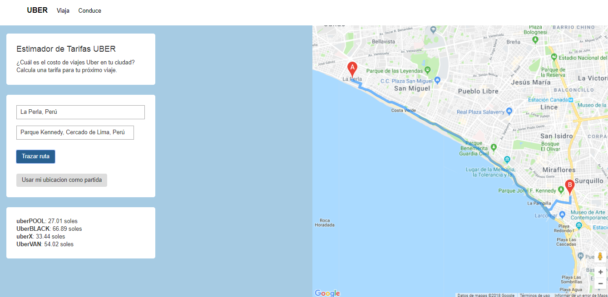

# Fare-Estimate
## **Descripcion del proyecto:**
  - Este proyecto contiene una página web que estima cuanto se va a pagar por un vieaje usando el servicio uber.

## **Herramientas utilizadas:**
  - HTML5
  - CSS3
  - Bootstrap
  - Api de google maps, Uber

